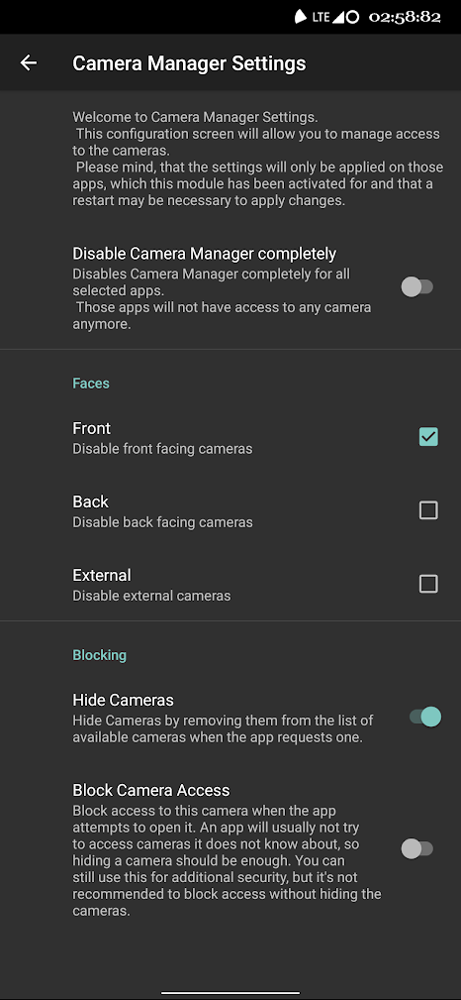

# CameraControl
Next level camera management.

CameraControl lets you manage access to your cameras depending on which side of the phone they face.

Why? Because I hate it when Snapchat opens up and forces me to see my own depression. But completely disabling all the cameras for Snapchat would render the whole app useless.

This was developed and tested on `LineageOS 17.1`, but should work on any android `>= 8.1`.

### How to install:

1. Install the module on a system with a running XPosed framework
1. Activate the module and select apps you want to limit camera access to.

### How to configure:

- Route 1:
    - Go back to the module list
    - Long press on `CameraControl` and select App Info
    - On the bottom, click on `Advanced`
    - Click on `Additional settings in the app`
- Route 2:
    - Go into device settings
    - Click on apps
    - Somehow tell the device to show all apps
    - Select `CameraControl`
    - On the bottom, click `Advanced`
    - Click on `Additional settings in the app`
- Route 3:
    - Open up an ADB shell
    - Run command `am start-activity com.programminghoch10.cameracontrol/.SettingsActivity`

Now configure away!

___Small intel:__ The configure activity is not accessible from the launcher, 
because LSPosed does not let modules hide their own launcher icons by default anymore. 
Defining a settings activity is an easy way to provide an accessible configuration interface, 
without forcing yet another launcher icon into the list.
One does not have to open the menu often anyways._

### What it looks like

### How it works (technical stuff)

Here is how this module prevents access and hides the cameras.

* Camera2 API  
    * Hiding cameras  
        This module is hiding cameras by removing them from the results of the method `getCameraIdList`. For each camera on this list, it queries the `CameraCharacteristics` of that camera and removes it from the list if this camera meets the filter requirements.
    * Block camera access  
        This module is blocking camera access by hooking method `openCamera`. Before the camera open call is sent to the system, this module checks if the camera shall be filtered and if so, prevents the system open call.
    * Hide flash  
        This module hides the existence of the flash by hooking method `get` within the `CameraCharacteristics`. If the key for flash is queried, it returns `false` and if the key for autofocus capabilites is queried, it removes flash associated focus capabilites from the list.
    * Disable all cameras  
        The module disables the whole Camera2 API by setting the testing flag `sCameraServiceDisabled` to `true`. This way the internal camera manager will not respond to calls anymore.
* Camera API (deprecated)  
    The old camera api is depricated since android 5 and most applications do not use it.
    * Hide / Block cameras  
        This module does not support seperated hiding and blocking for the old camera api since those mechanisms are linked together. If one is selected, both mechanisms will be active.
        * Hide cameras  
            The cameras are hidden by changing the result of the method `getNumberOfCameras`. The module checks each camera in the list for filter criteria and lowers the counter when a camera should be hidden.
            At the same time it saves a new mapping of camera indicies to be used by the blocking access hooks.
        * Block camera access  
            To block the camera access the module hooks method `open`. Before relaying the system call, it checks the new camera mapping created whilst hiding the cameras and also additionally checks for the filter criteria.
    * Hide flash  
        The module tries to hide the flash by overwriting the result of `getSupportedFlashModes`.
        It also prevents calls to `setFlashMode` in order to prevent the flash from being turned on.
    * Disable all cameras  
        Disabling the camera api is not that easy, so instead we just activate full blocking capabilites.
